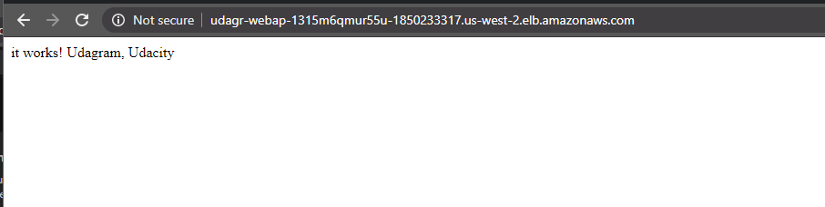

# Udagram
 

Udacity Cloud DevOps Project 2 - Infrastructure as Code
Deploy a high-availability web app using CloudFormation.

To see my deployment, go to http://udagr-webap-1315m6qmur55u-1850233317.us-west-2.elb.amazonaws.com/.

Here is the picture of the working page:


## Prerequisites
    - An AWS account
    - The AWS CLI (https://aws.amazon.com/cli/)

## Deployment
Using the AWS CLI, run:
    
```sh
./init.sh
``` 
This will create the S3 bucket, upload the zip file, and create the IAM role. You'll see a message in the terminal when it's finished. Then, run:

```sh  
./create.sh udagram-network network.yml network-params.json
```
And finally, run:

```sh
./create.sh udagram-servers servers.yml servers-params.json
```

## Authors
 - Antonella Bernobich Dean - [aberdean](https://github.com/aberdean)

## License
This project is licensed under the MIT License - see the [LICENSE](https://github.com/aberdean/udagram/blob/master/LICENSE) file for details.
